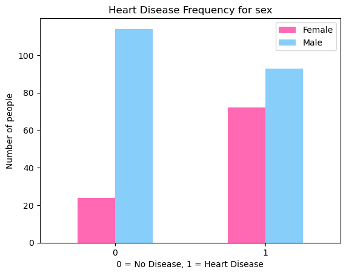
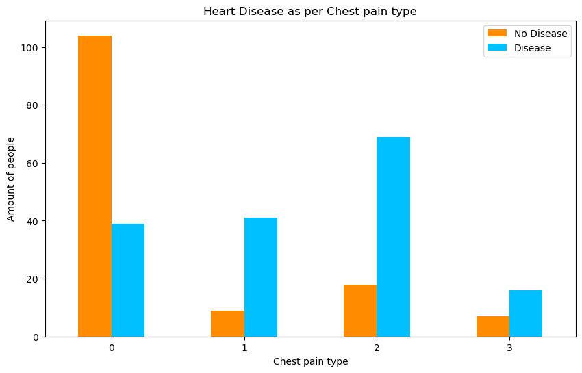
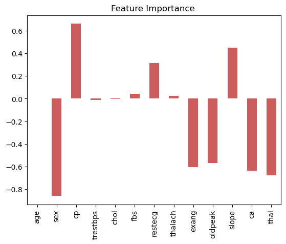

# Heart-Disease-Analysis
This notebook looks into using various Python-based machine learning and data science libraries in an attempt to build a machine learning model capable of predicting weather or not someone has heart disease based on their medical attributes.

Taking the following approach:

1. Problem definition
2. Data
3. Evaluation
4. Features
5. Modelling
6. Experimentation

## 1. Problem Definition

In a statement,
> Given clinical parameters about a patient, can we predict whether or not they have heart disease?

## 2. Data

The original data came from the Cleavland data from the UCI Machine Learning Repository. https://archive.ics.uci.edu/ml/datasets/heart+Disease

There is also a version of it available on Kaggle. https://www.kaggle.com/datasets/sumaiyatasmeem/heart-disease-classification-dataset

#### EDA

This bar chart suggests that number of females having heart disease tends to be more than that of males.

This plot suggests that the ratio of heart-disease to chest pain type increases with the increase in chest-pain. It is surprising to see that people with type 2 chest pain tends to have maximum risk of heart-disease while in the data dictionary it specifies that chest-pain type 2 is non-heart related pain.

## 3. Evaluation 

> If we can reach 95% accuracy at predicting whether or not a patient has heart disease during the proof of concept, we'll pursue the project.

## 4. Features

**Create data dictionary**

1. age - age in years
2. sex - (1 = male; 0 = female)
3. cp - chest pain type
    * 0: Typical angina: chest pain related decrease blood supply to the heart
    * 1: Atypical angina: chest pain not related to heart
    * 2: Non-anginal pain: typically esophageal spasms (non heart related)
    * 3: Asymptomatic: chest pain not showing signs of disease
4. trestbps - resting blood pressure (in mm Hg on admission to the hospital) anything above 130-140 is typically cause for concern
5. chol - serum cholestoral in mg/dl
    * serum = LDL + HDL + .2 * triglycerides
    * above 200 is cause for concern
6. fbs - (fasting blood sugar > 120 mg/dl) (1 = true; 0 = false)
    * '>126' mg/dL signals diabetes
7. restecg - resting electrocardiographic results
    * 0: Nothing to note
    * 1: ST-T Wave abnormality
        * can range from mild symptoms to severe problems
        * signals non-normal heart beat
    * 2: Possible or definite left ventricular hypertrophy
        * Enlarged heart's main pumping chamber
8. thalach - maximum heart rate achieved
9. exang - exercise induced angina (1 = yes; 0 = no)
10. oldpeak - ST depression induced by exercise relative to rest looks at stress of heart during excercise unhealthy heart will stress more
11. slope - the slope of the peak exercise ST segment
    * 0: Upsloping: better heart rate with excercise (uncommon)
    * 1: Flatsloping: minimal change (typical healthy heart)
    * 2: Downslopins: signs of unhealthy heart
12. ca - number of major vessels (0-3) colored by flourosopy
    * colored vessel means the doctor can see the blood passing through
    * the more blood movement the better (no clots)
13. thal - thalium stress result
    * 1,3: normal
    * 6: fixed defect: used to be defect but ok now
    * 7: reversable defect: no proper blood movement when excercising
14. target - have disease or not (1=yes, 0=no) (= the predicted attribute)

#### Feature Importance

After conducting a feature importance analysis on the dataset, the following insights were gained:

**Positive Correlation:**
* The feature 'cp' (chest pain type) exhibits the highest positive correlation with heart disease.

**Negative Correlation:**
* On the contrary, 'sex' shows the most negative correlation with heart disease.

**Minimal Correlation:**
* Features such as 'chol' (cholesterol), 'age', 'trestbps' (resting blood pressure), 'thalach' (maximum heart rate) demonstrate minimal correlation with the dataset.

**Future Modeling Considerations**
* Based on these findings, future iterations of modeling may benefit from excluding 'chol', 'age', 'trestbps', and 'thalach' to potentially enhance accuracy. This strategic approach aims to streamline the model and focus on the most impactful features for better predictive performance.